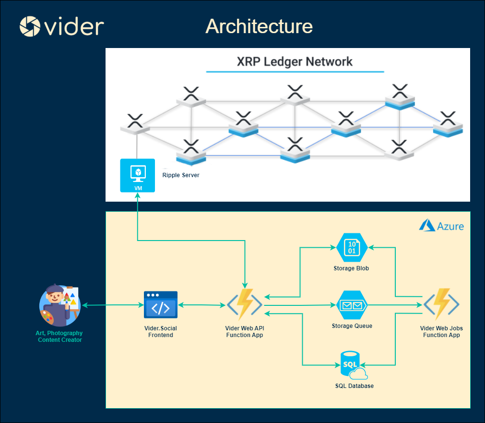

# VIDER

**Vider** is a social network and a XRPL-based NFT Creation and Marketplace Platform. As social networking platform, any users (often called **creators**) can socialize (by posting on their feeds about anything). As a NFT Creation/Marketplace Platfrom, creators can create, gift, sell, and buy NFTs.

## FEATURES
As a **creator**,   
- You can turn your digital art piece into an NFT. 
- You can earn some $XRP when someone subscribed to you. 
- You can setup your NFT Rewards System to reward your subscribers an NFT automatically when they subscribed.
- You can gift your NFTs to other creators.
- You can have the option to sell your NFT exclusively to your subscribers on marketplace.
- You can sell your NFTs to anyone on marketplace.
- You can buy NFTs from your favorite creators on marketplace
- You can subscribe to your favorite creators and can receive an NFT Reward from them.
- You can burned your NFTs.
- You can create and like a post and see all posts from other creators on your feeds.

## ARCHITECTURE

## TECHNOLOGIES
- For the blockchain component, it uses **XRPL (NFT-DEVNET)**. 
- For Web Frontend, it uses **Blazor Web Assembly (WASM)**. 
- For Web API: **Azure Function Apps (Serverless) (.NET 6.0)**
- For Web Jobs: **Azure Function Apps (Serverless) (.NET 6.0)**
- For File/Blob and Queue Storage: **Azure Storage Account**
- For Database: **Azure SQL Database**
- For Cloud Hosting: **Azure**
- Programming Language: **C#**

## DEMO

- Link: **[Web App](https://app.nftdev.vider.social)**
- Credentials:
	- You can create an account;
	- Or you the following credential:
		- Username: **johndoe**
		- Password: **password**

## GUIDES:
- Web API/Web Jobs Setup Guide: **See [Web API Setup Guide](src/backend/README.Backend.md)**
- Web Frontend Setup Guide: **See [Web Frontend Setup Guide](src/app/README.Frontend.md)**
- App Guide: **See [App Guide](assets/vider-social-app-guide.pdf)**

